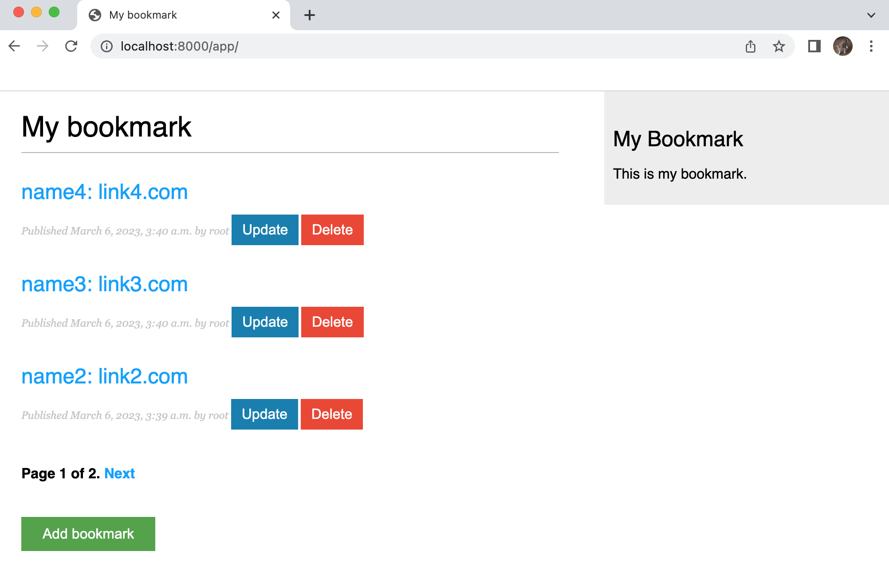

# Bookmarks Application

This is a full-stack web application built with Django and Docker, using Postgresq as the database management system. The application allows users to register and login, create bookmarks and assign them to tags. Bookmark can have multiple tags, and a bookmark can belong to multiple tags. The home page displays a list of bookmarks, and users can add new bookmarks using the "ADD" button.

## Prerequisites

- Docker
- Docker Compose

## Setup

1. Clone the repository to your local machine using the following command:

```bash

git clone https://github.com/zhu-weijie/bookmarks.git
```

1. Navigate to the cloned directory using the following command:

```bash

cd bookmarks
```

1. Start the application using the following command:

```bash

docker-compose up -d --build
```

This command will create the Docker containers and build the application.

1. Migrate the database using the following command:

```bash

docker-compose exec web python manage.py migrate --noinput
```

1. Create a superuser using the following command:

```bash

docker-compose exec web python manage.py createsuperuser
```

This command will prompt you to enter a username, email, and password for the superuser account.

1. Once the above steps have been completed, you can access the application at http://localhost:8000/app.


## Usage

- To create a new bookmark, click on the "ADD" button on the home page. This will redirect you to the add bookmark page, where you can enter the bookmark name, URL, and relevant tags.





- To view a bookmark, click on the bookmark name on the home page. This will redirect you to the bookmark detail page, where you can view the bookmark name, URL, and associated tags.


- To update a bookmark, click on the "Update" button on the bookmark detail page. This will redirect you to the update bookmark page, where you can modify the bookmark name, URL, and associated tags.


- To delete a bookmark, click on the "Delete" button on the bookmark detail page. This will remove the bookmark from the database.

